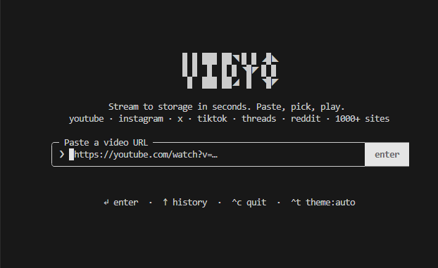

# vidyo

```
  █ █ ███ ██◥ █ █ ◢█◣
  █ █  █  █ █ ◥█◤ █ █
   █  ███ ██◢  █  ◥█◤
```

> **Stream to storage in seconds. Paste, pick, play.**

A luxurious, blazing-fast **terminal UI** for downloading videos from YouTube, Instagram, X (Twitter), TikTok, Threads, Reddit, and **1000+ more sites** — all without leaving your command line.

---

## ✨ Features

- 🎬 **1000+ supported sites** — YouTube, Instagram, X, TikTok, Threads, Reddit, Vimeo, SoundCloud, and more (powered by `yt-dlp`)
- ⚡ **Instant clipboard detection** — paste a URL and it auto-detects it before you type
- 🎨 **15 beautiful themes** — cycle with `^T` in the terminal
- 📼 **Format picker** — select between video resolutions or audio-only download
- 🕒 **Download history** — browse previously downloaded videos with `↑`
- 📊 **Live progress bar** — real-time speed, ETA, and file size feedback
- 🖱️ **Mouse click support** — click the logo to go home, click buttons to act
- 🎞️ **FFmpeg bundled** — no separate installation required
- 💾 **Saves to `~/Downloads`** automatically
- 🔒 **Zero config** — works out of the box

---

## 📸 Preview

<div align="center">
  
</div>

---

## 🚀 Installation

### Requirements

| Dependency | Version  |
|------------|----------|
| Node.js    | ≥ 18     |
| Bun        | ≥ 1.0    |

### Install from npm

```bash
npm install -g vidyo-cli
# or
bun install -g vidyo-cli
```

### Run directly (no install)

```bash
npx vidyo-cli
# or
bunx vidyo-cli
```

---

## 🛠️ Development

### Clone & Install

```bash
git clone https://github.com/HA2345567/vidyo.git
cd vidyo
bun install
```

### Run in dev mode

```bash
bun start
```

### Build

```bash
bun run build
```

### Watch mode (auto-rebuild on changes)

```bash
bun run dev:cli
```

### Run tests

```bash
bun test
```

### Typecheck

```bash
bun run typecheck
```

### Lint

```bash
bun run lint
```

---

## 📁 Project Structure

```
vidyo/
├── src/
│   ├── App.tsx                  # Main terminal app entry
│   ├── cli.tsx                  # CLI bootstrap & flags
│   ├── theme.tsx                # Theme system (15 themes)
│   ├── components/
│   │   ├── logo.tsx             # Animated VIDYO ASCII logo
│   │   ├── framed-input.tsx     # URL input with frame styling
│   │   ├── fullscreen.tsx       # Full terminal canvas wrapper
│   │   ├── progress-bar.tsx     # Real-time download progress
│   │   ├── pannel.tsx           # Info panel component
│   │   ├── shortcuts-bar.tsx    # Keyboard hints bar
│   │   └── text-input.tsx       # Styled text input
│   └── lib/
│       ├── ytdlp.ts             # yt-dlp process management
│       ├── clipboard.ts         # Clipboard URL detection
│       ├── history.ts           # Download history (JSON)
│       ├── format.ts            # Bytes, duration, speed utilities
│       ├── format.test.ts       # Unit tests for format utilities
│       ├── platform.ts          # OS platform detection
│       ├── click-map.ts         # Mouse click target mapping
│       └── use-mouse-click.ts   # Ink mouse click hook
├── tsup.config.json             # tsup bundler config
├── tsconfig.json                # TypeScript config
├── package.json
└── .gitignore
```

---

## 🎨 Themes

Switch themes at any time by pressing **`Ctrl + T`** while the app is running.

| Theme       | Style                                  |
|-------------|----------------------------------------|
| `auto`      | Inherits your terminal default         |
| `light`     | Clean white, minimal                   |
| `dark`      | Crisp dark with white text             |
| `red`       | Crimson on deep ruby background        |
| `yellow`    | Amber gold on dark onyx                |
| `sunset`    | Sunset orange with warm dark bg        |
| `neon`      | Electric teal & hot pink on midnight   |
| `dracula`   | Classic Dracula purple palette         |
| `nord`      | Cool Nordic arctic blues               |
| `catppuccin`| Pastel Mocha-inspired palette          |
| `tokyo`     | Tokyo Night purple/blue                |
| `gruvbox`   | Retro warm earthy tones                |
| `rosepine`  | Elegant rose and pine muted tones      |
| `matrix`    | Green-on-black Matrix terminal         |
| `cyberpunk` | Cyan & magenta neon on black           |

---

## ⌨️ Keyboard Shortcuts

| Key         | Action                           |
|-------------|----------------------------------|
| `↵ Enter`   | Grab video / confirm selection   |
| `↑ / ↓`     | Browse download history          |
| `^T`        | Cycle to next theme              |
| `^C`        | Quit the application             |

---

## 🔧 How It Works

1. **Paste a video URL** into the input prompt.
2. **vidyo probes** the URL using `yt-dlp` to fetch available formats.
3. **Pick a format** — video in various resolutions or audio-only.
4. **Download begins** with live speed, ETA, and file size displayed.
5. **File saved** to `~/Downloads` automatically.
6. **History logged** to `~/.config/vidyo/history.json`.

---

## 📦 Tech Stack

| Library           | Purpose                              |
|-------------------|--------------------------------------|
| [Ink](https://github.com/vadimdemedes/ink) | React for terminal UIs |
| [yt-dlp](https://github.com/yt-dlp/yt-dlp) | Video downloading engine |
| [ffmpeg-static](https://github.com/eugeneware/ffmpeg-static) | Bundled FFmpeg binary |
| [React 19](https://react.dev) | UI component framework |
| [TypeScript](https://www.typescriptlang.org) | Type safety |
| [tsup](https://tsup.egoist.dev) | ESM bundler |
| [Bun](https://bun.sh) | Runtime & test runner |

---

## 🧪 Testing

```bash
bun test
```

The test suite covers format utilities:

```
✓ formatBytes formats bytes correctly
✓ formatDuration formats seconds to MM:SS or HH:MM:SS
✓ truncate shortens string
✓ shortenPath shortens path
✓ wrapText wraps words within width
✓ formatSpeed formats speed correctly

6 pass · 0 fail
```

---

## 🤝 Contributing

Contributions are welcome! Here's how to get started:

1. **Fork** the repository
2. **Clone** your fork:
   ```bash
   git clone https://github.com/your-username/vidyo.git
   ```
3. **Create** a feature branch:
   ```bash
   git checkout -b feat/my-awesome-feature
   ```
4. **Commit** your changes:
   ```bash
   git commit -m "feat: add my awesome feature"
   ```
5. **Push** and open a **Pull Request**

Please ensure `bun run prepublishOnly` passes before submitting.

---

## 📜 License

MIT © [HA2345567](https://github.com/HA2345567)

---

## 🔗 Links

- **GitHub**: [github.com/HA2345567/vidyo](https://github.com/HA2345567/vidyo)
- **Issues**: [github.com/HA2345567/vidyo/issues](https://github.com/HA2345567/vidyo/issues)
- **yt-dlp supported sites**: [github.com/yt-dlp/yt-dlp/blob/master/supportedsites.md](https://github.com/yt-dlp/yt-dlp/blob/master/supportedsites.md)

---

<div align="center">
  <sub>Built with ❤️ for developers who live in the terminal.</sub>
</div>
